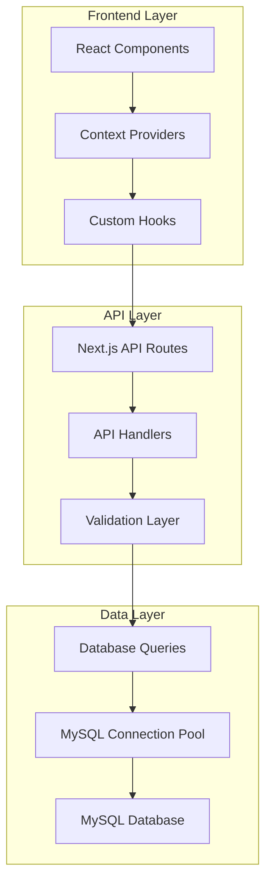

# Design Document

## Overview

本设计文档描述了将Xinsd 苍蝇饭馆前端应用从静态数据源迁移到基于MySQL数据库的API服务的完整架构。该系统将包含一个Next.js API路由后端服务和修改后的前端组件，实现完整的数据持久化和CRUD操作。

### 技术栈选择

- **后端**: Next.js API Routes (基于现有项目结构)
- **数据库**: MySQL (已有配置和初始化脚本)
- **前端**: React + TypeScript (保持现有技术栈)
- **数据库连接**: mysql2/promise (已在database/config.js中配置)
- **状态管理**: React Context (保持现有架构)

## Architecture

### 系统架构图



### 数据流架构

1. **前端组件** 通过 Context API 触发数据操作
2. **Context Providers** 调用自定义 hooks 进行API请求
3. **API Routes** 接收请求并进行参数验证
4. **数据库查询层** 执行SQL操作并返回结果
5. **响应数据** 通过相同路径返回到前端组件

## Components and Interfaces

### API Routes 结构

```
app/api/v1/
├── menu/
│   ├── items/route.ts          # GET /api/v1/menu/items
│   ├── item/route.ts           # GET /api/v1/menu/item
│   ├── add-item/route.ts       # POST /api/v1/menu/add-item
│   └── delete-items/route.ts   # POST /api/v1/menu/delete-items
├── categories/
│   ├── route.ts                # GET /api/v1/categories
│   ├── add/route.ts            # POST /api/v1/categories/add
│   └── delete/route.ts         # POST /api/v1/categories/delete
├── recipes/
│   └── generate/route.ts       # POST /api/v1/recipes/generate
└── upload/
    └── image/route.ts          # POST /api/v1/upload/image
```

### 前端服务层

```typescript
// lib/api-client.ts
interface ApiClient {
  // 商品相关
  getMenuItems(params: GetMenuItemsParams): Promise<MenuItemsResponse>
  getMenuItem(id: number): Promise<MenuItem>
  addMenuItem(data: AddMenuItemRequest): Promise<MenuItem>
  deleteMenuItems(ids: number[]): Promise<DeleteResponse>
  
  // 分类相关
  getCategories(): Promise<Category[]>
  addCategory(data: AddCategoryRequest): Promise<Category>
  deleteCategory(id: string): Promise<DeleteResponse>
  
  // 菜谱生成
  generateRecipe(data: RecipeGenerateRequest): Promise<RecipeResponse>
  
  // 图片上传
  uploadImage(file: File, type: 'item' | 'category'): Promise<UploadResponse>
}
```

### 数据库服务层

```typescript
// lib/database-service.ts
interface DatabaseService {
  // 基于现有 database/config.js 的查询函数
  getCategories(): Promise<Category[]>
  getMenuItems(params: QueryParams): Promise<MenuItemsResult>
  getMenuItem(id: number): Promise<MenuItem | null>
  addMenuItem(data: MenuItemData): Promise<MenuItem>
  deleteMenuItems(ids: number[]): Promise<DeleteResult>
  addCategory(data: CategoryData): Promise<Category>
  deleteCategory(id: string): Promise<DeleteResult>
  saveRecipe(data: RecipeData): Promise<{ recipe_id: number }>
}
```

## Data Models

### API 请求/响应模型

```typescript
// 商品相关
interface GetMenuItemsParams {
  category?: string
  search?: string
  page?: number
  limit?: number
}

interface MenuItemsResponse {
  code: number
  message: string
  data: {
    items: MenuItem[]
    pagination: {
      page: number
      limit: number
      total: number
      total_pages: number
    }
  }
}

interface AddMenuItemRequest {
  name: string
  description: string
  category: string
  image?: string
}

// 分类相关
interface AddCategoryRequest {
  name: string
  image?: string
}

// 菜谱生成
interface RecipeGenerateRequest {
  cart_items: CartItem[]
  requirements: {
    dish_count?: number
    soup_count?: number
    spice_level?: string
    restrictions?: string
    other_requirements?: string
  }
}

interface RecipeResponse {
  code: number
  message: string
  data: {
    recipe_content: string
    generated_at: string
  }
}
```

### 前端数据模型更新

```typescript
// lib/types.ts - 更新现有类型
interface MenuItem {
  id: number  // 改为数字类型，匹配数据库
  name: string
  category: string
  image: string
  description: string
}

interface Category {
  id: string  // 保持字符串类型（分类代码）
  name: string
  image: string
}

// 新增API相关类型
interface ApiResponse<T> {
  code: number
  message: string
  data: T
}

interface ApiError {
  code: number
  message: string
  error?: {
    type: string
    field?: string
  }
}
```

## Error Handling

### API错误处理策略

1. **统一错误响应格式**
```typescript
interface ErrorResponse {
  code: number
  message: string
  error?: {
    type: string
    field?: string
  }
}
```

2. **错误类型分类**
- `400` - 请求参数错误
- `404` - 资源不存在
- `409` - 资源冲突（如商品名称重复）
- `422` - 数据验证失败
- `500` - 服务器内部错误

3. **前端错误处理**
```typescript
// lib/api-client.ts
class ApiClient {
  private async handleResponse<T>(response: Response): Promise<T> {
    if (!response.ok) {
      const error = await response.json()
      throw new ApiError(error.message, error.code, error.error)
    }
    return response.json()
  }
}

// 在Context中统一处理错误
const handleApiError = (error: ApiError) => {
  toast({
    title: "操作失败",
    description: error.message,
    variant: "destructive"
  })
}
```

### 数据库错误处理

1. **连接错误处理**
```typescript
// 在每个API路由中检查数据库连接
try {
  await testConnection()
} catch (error) {
  return NextResponse.json(
    { code: 500, message: "数据库连接失败" },
    { status: 500 }
  )
}
```

2. **SQL错误处理**
```typescript
// 统一的数据库错误处理
const handleDatabaseError = (error: any) => {
  if (error.code === 'ER_DUP_ENTRY') {
    return { code: 409, message: "数据已存在" }
  }
  if (error.code === 'ER_NO_REFERENCED_ROW_2') {
    return { code: 400, message: "关联数据不存在" }
  }
  return { code: 500, message: "数据库操作失败" }
}
```

## Testing Strategy

### API测试

1. **单元测试**
```typescript
// __tests__/api/menu/items.test.ts
describe('/api/v1/menu/items', () => {
  test('should return menu items with pagination', async () => {
    const response = await request(app)
      .get('/api/v1/menu/items?page=1&limit=12')
      .expect(200)
    
    expect(response.body.data.items).toBeInstanceOf(Array)
    expect(response.body.data.pagination).toBeDefined()
  })
})
```

2. **集成测试**
```typescript
// __tests__/integration/menu-flow.test.ts
describe('Menu Management Flow', () => {
  test('should create, read, update, delete menu items', async () => {
    // 测试完整的CRUD流程
  })
})
```

3. **数据库测试**
```typescript
// __tests__/database/queries.test.ts
describe('Database Queries', () => {
  beforeEach(async () => {
    // 设置测试数据库
    await setupTestDatabase()
  })
  
  test('should query menu items correctly', async () => {
    const result = await queries.getMenuItems({})
    expect(result.items).toBeDefined()
  })
})
```

### 前端测试

1. **组件测试**
```typescript
// __tests__/components/menu-context.test.tsx
describe('MenuContext', () => {
  test('should fetch data from API on mount', async () => {
    // 测试Context是否正确调用API
  })
})
```

2. **API客户端测试**
```typescript
// __tests__/lib/api-client.test.ts
describe('ApiClient', () => {
  test('should handle API errors correctly', async () => {
    // 测试错误处理
  })
})
```

## Implementation Strategy

### 阶段1: 后端API开发

1. **设置API路由结构**
   - 创建 `app/api/v1/` 目录结构
   - 实现基础的路由处理器

2. **数据库集成**
   - 更新 `database/config.js` 为 TypeScript
   - 创建数据库服务层
   - 实现查询函数

3. **API接口实现**
   - 商品管理接口
   - 分类管理接口
   - 图片上传接口

### 阶段2: 前端API集成

1. **创建API客户端**
   - 实现统一的API调用层
   - 添加错误处理和类型安全

2. **更新Context Providers**
   - 修改 `MenuContext` 使用API调用
   - 保持现有接口兼容性

3. **组件更新**
   - 更新数据类型（ID从字符串改为数字）
   - 添加加载状态和错误处理

### 阶段3: 菜谱生成功能

1. **菜谱生成API**
   - 实现菜谱生成逻辑
   - 数据库存储菜谱记录

2. **前端集成**
   - 更新结算页面使用API
   - 保持现有UI和交互

### 阶段4: 图片上传功能

1. **文件上传处理**
   - 实现图片上传API
   - 文件存储和URL生成

2. **前端文件上传**
   - 更新添加商品/分类对话框
   - 集成图片上传功能

## Migration Strategy

### 数据迁移

1. **保持数据兼容性**
   - 数据库中的商品ID为数字
   - API层返回的分类ID为字符串代码
   - 前端组件保持现有接口

2. **渐进式迁移**
   - 先实现API，保持静态数据作为fallback
   - 逐步切换到API数据源
   - 最后移除静态数据文件

### 前端兼容性

1. **类型更新策略**
```typescript
// 渐进式类型更新
interface MenuItem {
  id: string | number  // 过渡期支持两种类型
  name: string
  category: string
  image: string
  description: string
}

// 类型转换工具
const normalizeMenuItem = (item: any): MenuItem => ({
  ...item,
  id: typeof item.id === 'string' ? parseInt(item.id) : item.id
})
```

2. **Context API更新**
```typescript
// 保持现有接口，内部切换到API
export function MenuProvider({ children }: { children: React.ReactNode }) {
  const [menuItems, setMenuItems] = useState<MenuItem[]>([])
  const [loading, setLoading] = useState(true)
  
  // 从API加载数据，保持现有接口
  const loadMenuItems = async () => {
    try {
      const data = await apiClient.getMenuItems({})
      setMenuItems(data.items)
    } catch (error) {
      // 错误处理
    } finally {
      setLoading(false)
    }
  }
}
```

## Performance Considerations

### 数据库优化

1. **查询优化**
   - 使用现有数据库索引
   - 实现分页查询减少数据传输
   - 缓存分类数据

2. **连接池管理**
   - 使用现有的连接池配置
   - 监控连接使用情况

### 前端优化

1. **数据缓存**
```typescript
// 简单的内存缓存
class ApiClient {
  private cache = new Map()
  
  async getCategories(): Promise<Category[]> {
    if (this.cache.has('categories')) {
      return this.cache.get('categories')
    }
    
    const data = await this.fetchCategories()
    this.cache.set('categories', data)
    return data
  }
}
```

2. **加载状态管理**
```typescript
// 统一的加载状态
interface LoadingState {
  menuItems: boolean
  categories: boolean
  operations: boolean
}
```

## Security Considerations

### API安全

1. **输入验证**
```typescript
// 使用zod进行请求验证
const addMenuItemSchema = z.object({
  name: z.string().min(1).max(200),
  description: z.string().min(1),
  category: z.string().min(1),
  image: z.string().optional()
})
```

2. **SQL注入防护**
   - 使用参数化查询（已在database/config.js中实现）
   - 输入数据清理和验证

3. **文件上传安全**
```typescript
// 文件类型和大小限制
const validateImageFile = (file: File) => {
  const allowedTypes = ['image/jpeg', 'image/png', 'image/webp']
  const maxSize = 5 * 1024 * 1024 // 5MB
  
  if (!allowedTypes.includes(file.type)) {
    throw new Error('不支持的文件类型')
  }
  
  if (file.size > maxSize) {
    throw new Error('文件大小超过限制')
  }
}
```

### 数据安全

1. **敏感数据保护**
   - 数据库连接信息使用环境变量
   - 不在前端暴露敏感信息

2. **错误信息安全**
   - 不在API响应中暴露内部错误详情
   - 统一的错误消息格式